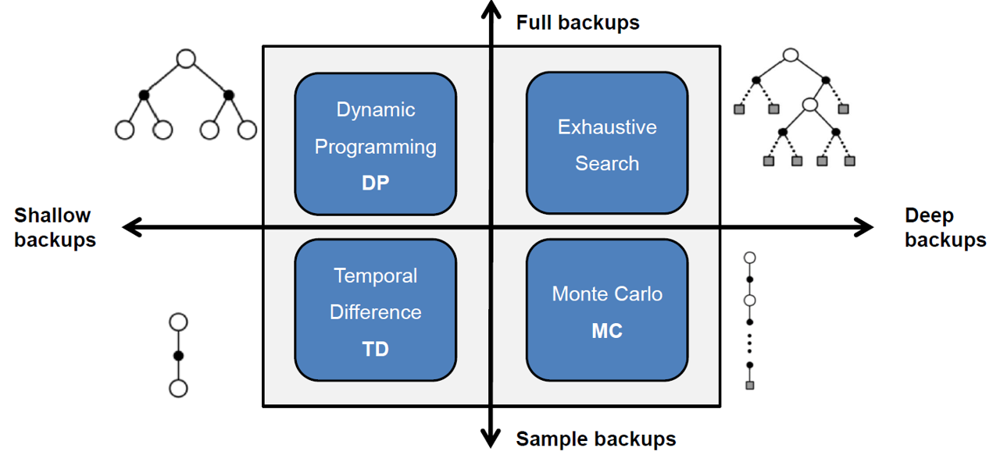
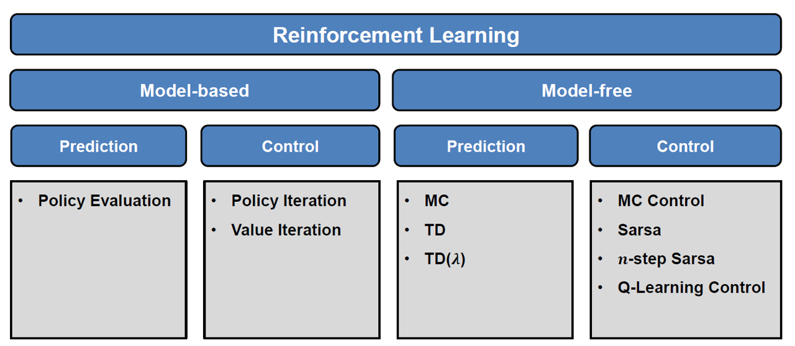
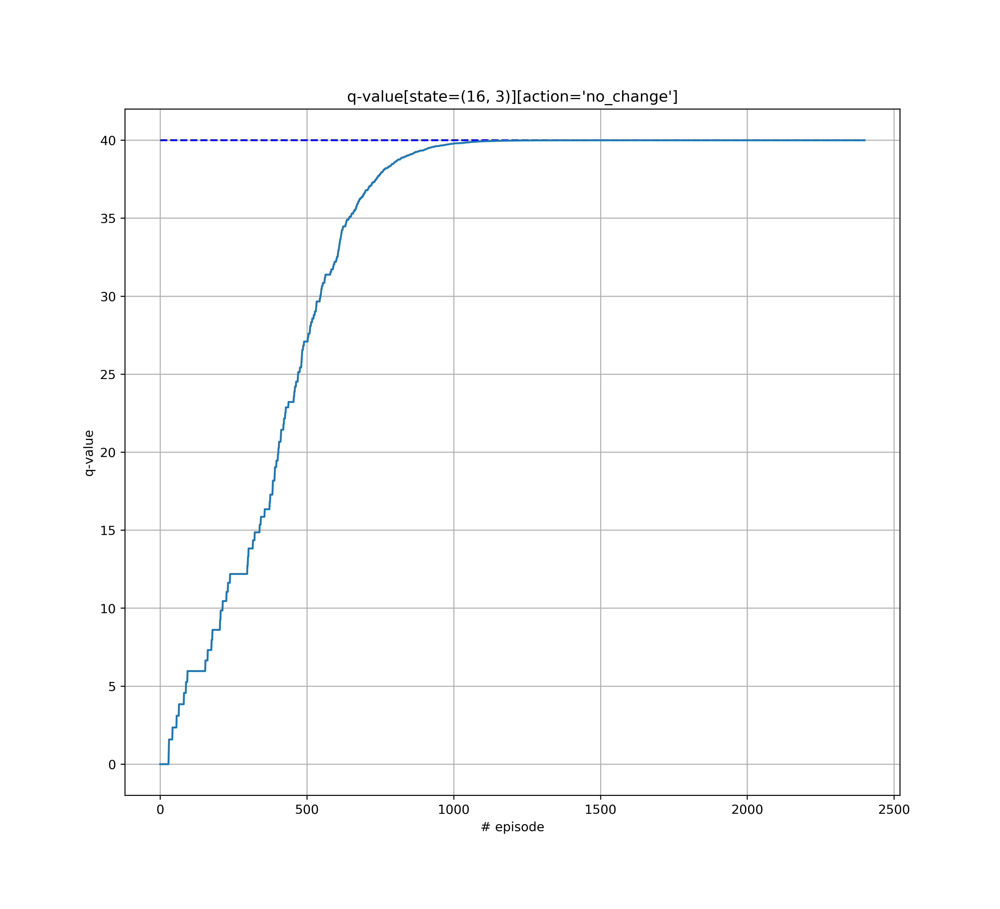

# Reinforcement Learning for Decision-Making for self-driving-cars

An practical implementation of RL algorithms for Decision-Making for Autonomous Driving

|   | 
|:--:| 
| *Optimal Policy and Value Function* |

## Structure
My repository is structured as follow. Each time a ```main```, an ```agent``` and an ```environment``` are required
- [`src`](src) contains
	- [`environments`](src/environments)
		- for now, only one simple environment is available
	- [`main_simple_road.py`](https://github.com/chauvinSimon/Advanced-Reinforcement-Learning-for-Decision-Making-in-self-driving-cars/blob/master/src/main_simple_road.py) is the ```main``` for the ```simple_road``` environment
		- useful tools for vizualisation help to understand how each agent works
	- [`brains`](src/brains)
		- [`simple_brains.py`](src/brains/simple_brains.py) contains the definition of simple agents, in particular:
			- One **Monte-Carlo** *model-free* control algorithms
			    - ```q_table``` is a [collections.defaultdict](https://docs.python.org/3/library/collections.html#collections.defaultdict)
			- Four **Temporal-Difference**-based *model-free* control algorithms
				- ```q_table``` is a [pandas.DataFrame](https://pandas.pydata.org/pandas-docs/stable/generated/pandas.DataFrame.html)
			    - Only the `learn()` method differs:
			        - Q-learning (= max-SARSA)
			        - SARSA
			        - SARSA-lambda
			        - expected-SARSA
			- One *model-based* **Dynamic Programming** method
				- ```q_table``` is a [numpy.array](https://docs.scipy.org/doc/numpy/reference/generated/numpy.array.html)
		
		- [`simple_DQN_tensorflow.py`](src/brains/simple_DQN_tensorflow.py) contains the definition of DQN agent with [tensorflow](https://www.tensorflow.org/)
			- *not stable yet*
		- [`simple_DQN_pytorch.py`](src/brains/simple_DQN_pytorch.py) contains the definition of DQN agent with [tensorflow](https://pytorch.org/)
			- *not stable yet*
			- *uncomment the* `import` *statements if you do not want to use it*

## Simple_road environment
A very basic scenario, but useful to apply and understand RL concepts.
The envrionment is designed similarly to [openai gym](https://github.com/openai/gym) [`env`](https://gym.openai.com/envs/#classic_control)

### Use case

Environment definition:
- Mission
	- The **agent** is driving on a straight road, while a **pedestrian is standing on the pavement**.
	- It has to **reach the end of the road** *(the goal)* with a **certain velocity**.

In addition, he must respect different constrains
- apply **traffic law**
- make sure to drive at a **reduce speed when passing close to the pedestrian**

> Let's make the agent learn how to do that!

<p align="center"> 

</p>

To **visualize the progress** of the driver at each episode, a **tkinter-base animation** can be used
- The **agent** is depicted with a square
 - The **colour** of the square represents the **velocity** of the agent
- The **goal** is depicted with a circle ```("G")```
- The **pedestrians** on the side is represented with a black circle

Note1:
- the **time between frames** can be adjusted in [`main_simple_road.py`](src/main_simple_road.py)

Note2: to **disable the animation**:
- to disable the ```Tkinter``` window, set in ```flag_tkinter = False``` in [`main_simple_road.py`](src/main_simple_road.py)
- if you do not want to use ```Tkinter``` module, set the flag to ```False``` and uncomment the first line in the definition of the ```class Road``` in [`environments`](src/environments)

**Discrete State space:**
- the longitudinal position
- the velocity 
The initial state is `[0, 3]`

**Discrete Action space:**
-	``` no_change ``` - Maintain current speed
-	``` speed_up ``` - Accelerate
-	``` speed_up_up ``` - Hard Accelerate
-	``` slow_down ``` - Decelerate
-	``` slow_down_down ``` - Hard Decelerate

**Reward Function:** classified into 4 groups *(See [`environments`](src/environments/simple_road_env.py) [road_env.py](https://github.com/chauvinSimon/Advanced-Reinforcement-Learning-for-Decision-Making-in-self-driving-cars/blob/master/road_env.py))*
 - time efficiency
 - traffic law
 - safety 
 - comfort

**Transition function:**
The transitions are based on the **next velocity**
	- e.g. if the Agent goes for `velocity = 3`, then its next position will be `3` cells further.

**Termination Condition:**
- The task is episodic
- One episode **terminates** after the Agent passed `position = 18`
- In order to solve the environment, the agent must get an **average return of** ```+17``` over ```100``` **consecutive episodes**.
	- Knowing that the **maximum possible return** is ```18```

Finally, **hard constrains** are used to eliminate certain undesirable behaviours
 - it is better to use **action-masking** rather than penalizing these behaviours in the reward function
 - it also **increases the learning speed** during training by limiting exploration

### Dependencies

Create a **conda environment**:
`conda create --name rl-for-ad python=3.6`

Install the packages:
`pip install -r requirements.txt`


Using python 3 with following modules:
- [numpy](http://www.numpy.org/)
- [matplotlib](https://matplotlib.org/)
- [pandas](https://pandas.pydata.org/)
- [random](https://docs.python.org/3/library/random.html)
- [time](https://docs.python.org/3/library/time.html)
- [json](https://docs.python.org/3/library/json.html)
- [pickle](https://docs.python.org/3/library/pickle.html) - to save the table in .pkl
- [tkinter](https://docs.python.org/3/library/tk.html) - to run the animation - can be removed with one parameter + 2 line-commentings
- [pytorch](https://pytorch.org/) is required only for the corresponding Deep Q-Network implementation
- [tensorflow](https://www.tensorflow.org/) is required only for the corresponding Deep Q-Network implementation

### RL Agents
All the RL algorithms presented in these figures are implemented. [Source](https://www6.in.tum.de/en/teaching/ss-18/seminar-reinforcement-learning-in-autonomous-driving/)

|   | 
|:--:| 
| _**DP**-, **MC**-, and **TD**-backups are implemented_ |

|   | 
|:--:| 
| _**Model-based** and **model-free** Control methods are implemented_ |
		
### Get Started
In [`src`](src), [`main_simple_road.py`](src/main_simple_road.py) is **the central file you want to use**.
	
Choose
- the control *Agent* you want to use _(uncomment the others)_
	- `Q-learning` (= `max-SARSA`)
	- `SARSA`
	- `SARSA-lambda`
	- `expected-SARSA`
	- `Monte-Carlo`
	- `Dynamic Programming`

- the task, playing with flags
	 - `training`
	 - `testing`
	 - `hyper-parameter tuning`

- if you want the environment window to be display
	 - with the flag `flag_tkinter = False` for the simple environment

### Results and Analysis:

#### Q-values

I tried different formats to store the q-values table:
- [pandas.DataFrame](https://pandas.pydata.org/pandas-docs/stable/generated/pandas.DataFrame.html)
- [collections.defaultdict](https://docs.python.org/3/library/collections.html#collections.defaultdict)
- [numpy.array](https://docs.scipy.org/doc/numpy/reference/generated/numpy.array.html)

Each one has its advantages and drawbacks.

The q-values are stored in a ```q-table``` that looks like:

```
[id][-------------------------actions---------------------------] [--state features--]
    no_change   speed_up  speed_up_up  slow_down  slow_down_down  position  velocity
0      -4.500  -4.500000       3.1441  -3.434166       -3.177462       0.0       0.0
1      -1.260  -1.260000       9.0490   0.000000        0.000000       2.0       2.0
2       0.396   0.000000       0.0000   0.000000        0.000000       4.0       2.0
3       2.178   0.000000       0.0000   0.000000        0.000000       6.0       2.0
```

#### Eligibility Trace for SARSA-Lambda 
SARSA-Lambda updates the model by giving reward to all the steps that contribute to the end return. It can consider
- One single step (**SARSA**) (```lambda=0```)
- all the steps in the episode (**Monte Carlo**) (```lambda=1```)
- in between (```lambda in [0,1]```)

It is useful to vizualize the ```Eligibility Trace``` in the process of ```SARSA-Lambda```. Here is an example of the ```lambda = 0.2``` and ```gamma = 0.99```
The `id` denotes the index of occurence: the smaller the index, the older the experience.
The first experience has been seem 6 steps ago. Therefore, its trace is `1 * (lambda * gamma) ** 6` = `0.000060`.
The trace decay is high due to small value of `lambda`. For this reason, it is closer to SARSA rather than Monte Carlo.

```
[id][-------------------------actions---------------------------] [--state features--]
   no_change  speed_up  speed_up_up  slow_down  slow_down_down  position  velocity
0   0.000060  0.000000        0.000        0.0        0.000000       0.0       3.0
1   0.000000  0.000304        0.000        0.0        0.000000       3.0       3.0
2   0.001537  0.000000        0.000        0.0        0.000000       7.0       4.0
3   0.000000  0.000000        0.000        0.0        0.007762      11.0       4.0
4   0.000000  0.000000        0.000        0.0        0.039204      13.0       2.0
5   0.000000  0.000000        0.198        0.0        0.000000      13.0       0.0
6   0.000000  0.000000        1.000        0.0        0.000000      15.0       2.0
7   0.000000  0.000000        0.000        0.0        0.000000      19.0       4.0
```

#### Model-Based Control with Dynamic Programming

|   | 
|:--:| 
| *Optimal Policy and Value Function* |

The **Policy Iteration** algorithm approximates the optimal Policy \pi*

Observations:
- the pedestrian is located near ```position = 12```
- therefore the speed must be smaller than ```3``` when passing ```position = 12```. Otherwise, an important negative reward is given.
- the values of states that are close to ```position = 12``` with ```velocity >= 4``` are therfore very low. There is no chance for these state to slow down enough before passing the pedestrian. Hence, they cannot escape the high penalty. 

I noticed that convergence of **Policy Iteration** is faster (~10 times) than **Value Iteration**
- ``` # Duration of Value Iteration = 114.28 - counter = 121 - delta_value_functions = 9.687738053543171e-06```
- ``` # Duration of Policy Iteration = 12.44 - counter = 5 - delta_policy = 0.0 with theta = 1e-3 and final theta = 1e-5```
- In addition, on the figure it can be seen that Value Iteration suggests starting with action ```no_change``` whatever the initial velocity. This cannot be the optimal policy.

#### Optimal policy
Model-free and Model-based agents all propose trajectories that are close or equal to the optimal one.
For instance the following episode (list of "state-action" pairs):
- ```[[0, 3], 'no_change', [3, 3], 'no_change', [6, 3], 'no_change', [9, 3], 'slow_down', [11, 2], 'no_change', [13, 2], 'speed_up', [16, 3], 'no_change', [19, 3]]```

Which makes sense:
- the agent **keeps his initial velocity**
- he **slows down** when **approaching the pedestrian**
- he then **speeds up** to reach the goal with the **required velocity**

#### Hyper-parameters 

It is possible to play with hyper-parameters and appreciate their impacts:
- the traffic parameters (in [simple_road_env.py](https://github.com/chauvinSimon/Advanced-Reinforcement-Learning-for-Decision-Making-in-self-driving-cars/blob/master/simple_road_env.py))
- the reward function (in [simple_road_env.py](https://github.com/chauvinSimon/Advanced-Reinforcement-Learning-for-Decision-Making-in-self-driving-cars/blob/master/src/environments/simple_road_env.py))
 - the RL-algorithm (in [RL_brain.py](https://github.com/chauvinSimon/Advanced-Reinforcement-Learning-for-Decision-Making-in-self-driving-cars/blob/master/src/main_simple_road.py))
 - the hyper-parameters (in [RL_brain.py](https://github.com/chauvinSimon/Advanced-Reinforcement-Learning-for-Decision-Making-in-self-driving-cars/blob/master/src/main_simple_road.py))
``` 
 hyper_parameters = (
            method_used,  # the control RL-method
            gamma_learning = 0.99,
            learning_rate_learning = 0.02,
            eps_start_learning = 1.0,
            eps_end_training = 0.02,
            eps_decay_training = 0.998466
        )
```

##### Epsilon-decay scheduling

I noticed that the **decay rate** of the ```epsilon``` has a  substantial impact on the *convergence* and the *performance* of the **model-free agents**

I implemented an **epsilon decay scheduling**. At each episode: ```eps = max(eps_end, eps_decay * eps)```
- hence the value ```eps_end``` is reached at ```episode_id = log10(eps_end/eps_start) / log10(eps_decay)```
- in order to reach this plateau in ```episode_id``` episodes , ```eps_decay = (eps_end / eps_start) ** (1/episode_id)```
- I found that setting ```eps_decay_training = 0.998466``` (i.e. 3000 episodes) helps converging to a **robust solution** for **all model-free agents**

#### Action-masking
I implemented the **action_masking** mechanism described in [Simon Chauvin, "Hierarchical Decision-Making for Autonomous Driving"](https://github.com/chauvinSimon/Hierarchical-Decision-Making-for-Autonomous-Driving)

It helps **reducing exploration** and it ensures **safety**.

This example of q-values for ```position = 1```, when driving at **maximal speed = 5**, the agent is prevented from ```speed_up``` actions (```q = -inf```).

```
velocity   no_change  speed_up  speed_up_up  slow_down  slow_down_down
0  -3.444510 -0.892310    -0.493900       -inf            -inf
1   1.107690  1.506100     1.486100  -5.444510            -inf
2   3.506100  3.486100     2.782100  -0.892310       -7.444510
3   5.486100  4.782100         -inf   1.506100       -2.892310
4   6.782100      -inf         -inf   3.486100       -0.493900
5       -inf      -inf         -inf   4.782100        1.486100  
  ```

#### Final value coherence checking

In the **Bellman equation**, if the episode is terminated, then ```q_target = r``` (next state has value 0)
- Therefore, in the Optimal Value Function, the q-values of states that are just about to terminate is equal to the reward associated to the transition caused by the action.
- I find it is very useful to monitor of such q-values in the learning process

|   | 
|:--:| 
| *Monitoring of the convergence of a given q-value* |

The q-value estimate for the state/action pair `([16, 3], "no_change")` **converges** to the optimal value (```+40``` = ```reward[reach end with correct velocity]```)

#### Generated files

Overview of the parameters used for the environment

 - [in .json](https://github.com/chauvinSimon/Reinforcement-Learning-for-Decision-Making-in-self-driving-cars/blob/master/src/environments/simple_road_env_configuration.json)

Weights of the Q-table

 - [in .pkl](https://github.com/chauvinSimon/Advanced-Reinforcement-Learning-for-Decision-Making-in-self-driving-cars/blob/master/results/q_table.pkl) for TD and MC
 - [in .npy](https://github.com/chauvinSimon/Advanced-Reinforcement-Learning-for-Decision-Making-in-self-driving-cars/blob/master/results/simple_road/dynamic_programming/opt_q_table_pi.npy) for DP

Plots in the training phase

 - [evolution of the return](https://github.com/chauvinSimon/Reinforcement-Learning-for-Decision-Making-in-self-driving-cars/blob/master/results/simple_road/return.png)
  - [count of steps per episode](https://github.com/chauvinSimon/Reinforcement-Learning-for-Decision-Making-in-self-driving-cars/blob/master/results/simple_road/step_counter.png)

Plots of the final Q-table

 - [Normalized Q-values](https://github.com/chauvinSimon/Advanced-Reinforcement-Learning-for-Decision-Making-in-self-driving-cars/blob/master/results/simple_road/plot_q_table.png)
 - [Best Q-values for each state](https://github.com/chauvinSimon/Advanced-Reinforcement-Learning-for-Decision-Making-in-self-driving-cars/blob/master/results/simple_road/plot_q_table.png)

|   | 
|:--:| 
| _Best actions learnt by **model-free** agent after 4000 episodes_ |
Due to the specification of the inital state, the model-free Agent cannot explore all the states.

|   | 
|:--:| 
| _Returns for each episode, during the training of a **model-free** agent_ |

The orange curve shows the average return over 100 consecutive episodes. It reaches the success threshold after 2400 episodes.

#### Example of settings

After training, [env_configuration.json](https://github.com/chauvinSimon/Advanced-Reinforcement-Learning-for-Decision-Making-in-self-driving-cars/blob/master/src/environments/simple_road_env_configuration.json) is generated to **summarize the configuration**.

```
{
  "min_velocity":0,
  "previous_action":null,
  "initial_state":[
    0,
    3,
    12
  ],
  "max_velocity_2":2,
  "state_ego_velocity":3,
  "obstacle1_coord":[
    12,
    2
  ],
  "actions_list":[
    "no_change",
    "speed_up",
    "speed_up_up",
    "slow_down",
    "slow_down_down"
  ],
  "goal_velocity":3,
  "goal_coord":[
    19,
    1
  ],
  "previous_state_position":0,
  "obstacle":null,
  "initial_position":[
    0,
    0
  ],
  "previous_state_velocity":3,
  "state_features":[
    "position",
    "velocity"
  ],
  "state_obstacle_position":12,
  "obstacle2_coord":[
    1,
    3
  ],
  "rewards_dict":{
    "goal_with_bad_velocity":-40,
    "negative_speed":-15,
    "under_speed":-15,
    "action_change":-2,
    "over_speed":-10,
    "over_speed_near_pedestrian":-40,
    "over_speed_2":-10,
    "per_step_cost":-3,
    "goal_with_good_velocity":40
  },
  "max_velocity_1":4,
  "max_velocity_pedestrian":2,
  "using_tkinter":false,
  "state_ego_position":0,
  "reward":0
}
```

## Future Works

I am working on a more complex environment with a richer state space.
Fine-tuning of hyper-parameter for DQN also belongs to the to-do list.
Stay tuned!

## Acknowledgments

* Initial inspiration from the very good [morvanzhou's tutorials](https://www.youtube.com/watch?v=pieI7rOXELI&list=PLXO45tsB95cIplu-fLMpUEEZTwrDNh6Ba&index=1)
* Project realized while completing the Udacity's [Deep Reinforcement Learning Nanodegree](https://www.udacity.com/course/deep-reinforcement-learning-nanodegree--nd893) program